# RevForge

**A forge for revisions.**

RevForge is a self-hosted Mercurial platform for repository hosting, changeset browsing, code review workflows, clone access, and operational visibility.

## Overview

RevForge is built for teams that want a Mercurial-native forge with a focused developer experience.

It brings together:

- repository hosting and provisioning
- changeset, history, branch, bookmark, and tag browsing
- repository-aware code browsing and markdown preview
- HTTPS and SSH clone access
- account, token, and SSH key management
- activity, auditability, and operational visibility

## Screenshots

### Landing Page

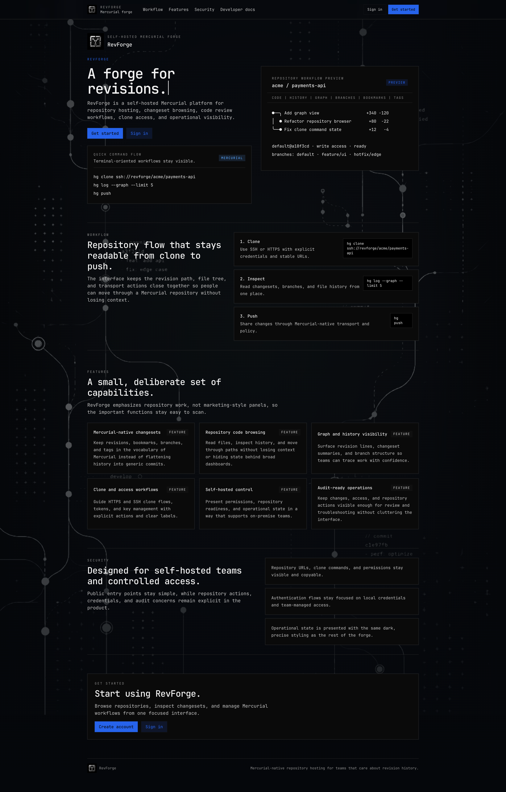

### Dashboard

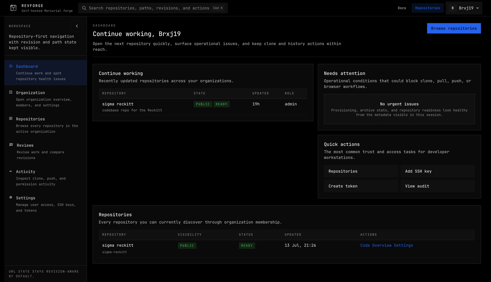

### Organization Overview

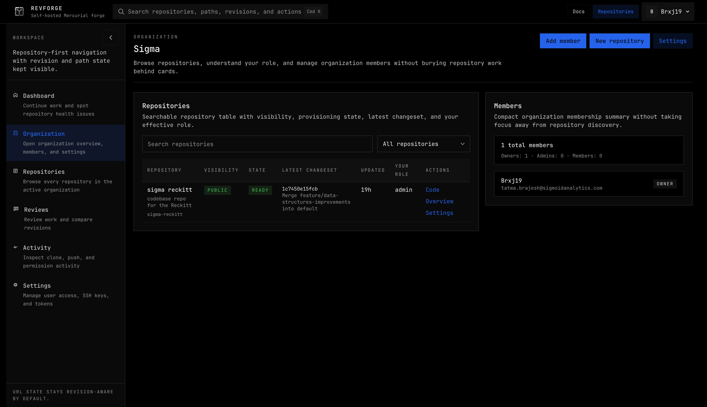

### Repository List

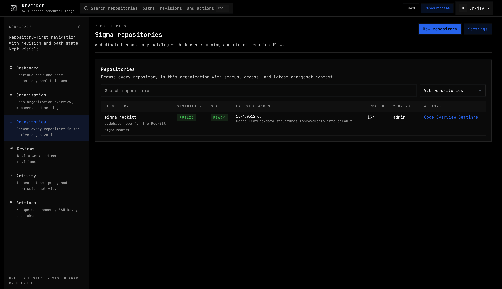

### Repository Overview

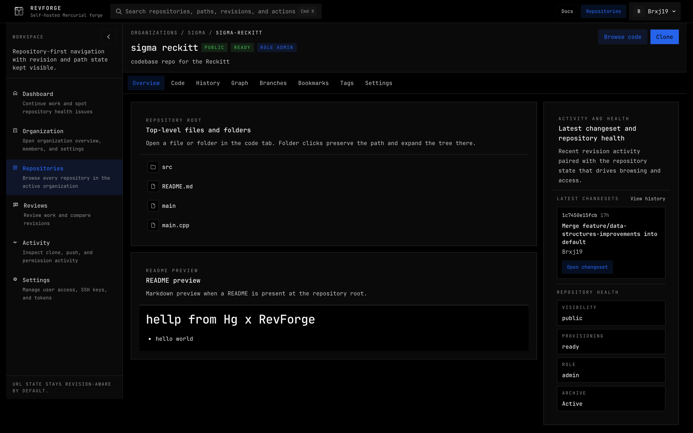

### Code Browser

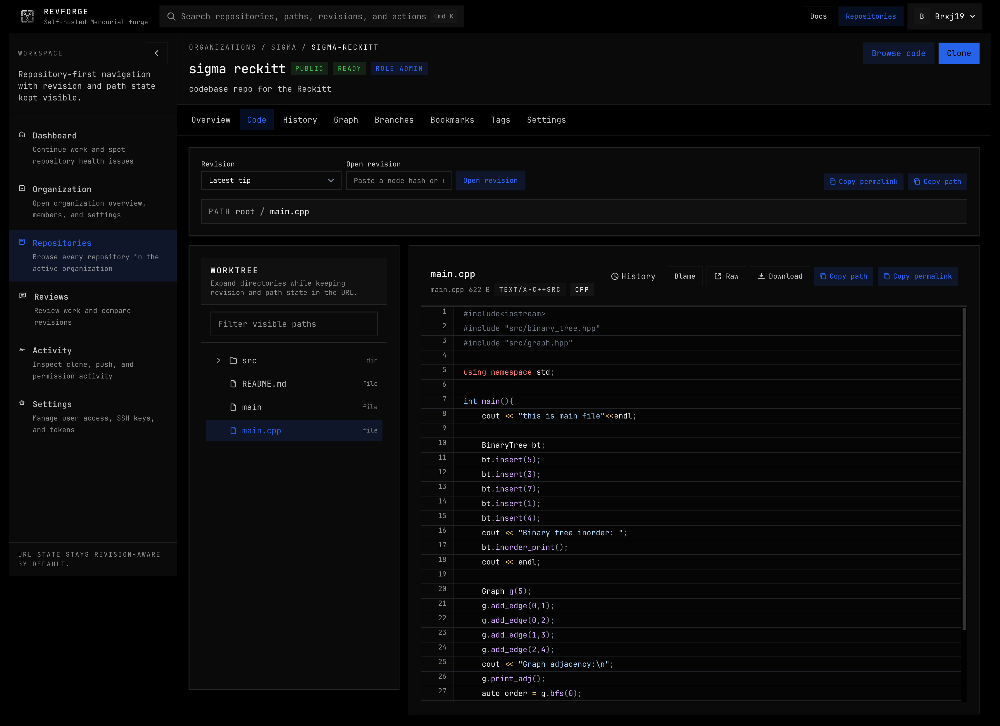

### History View

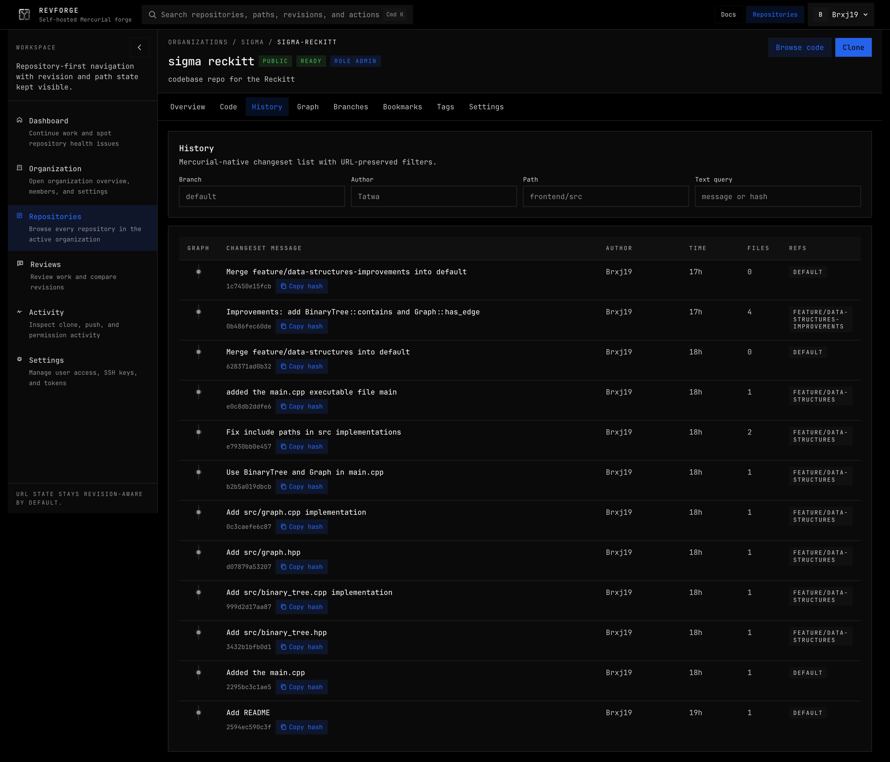

### Graph View

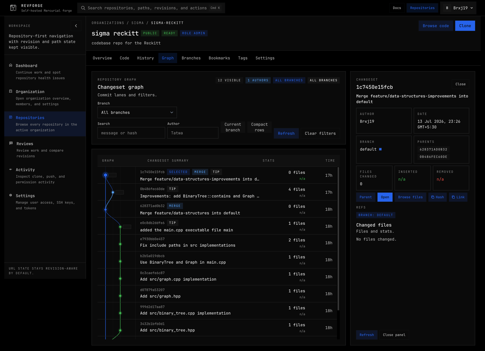

### Branches

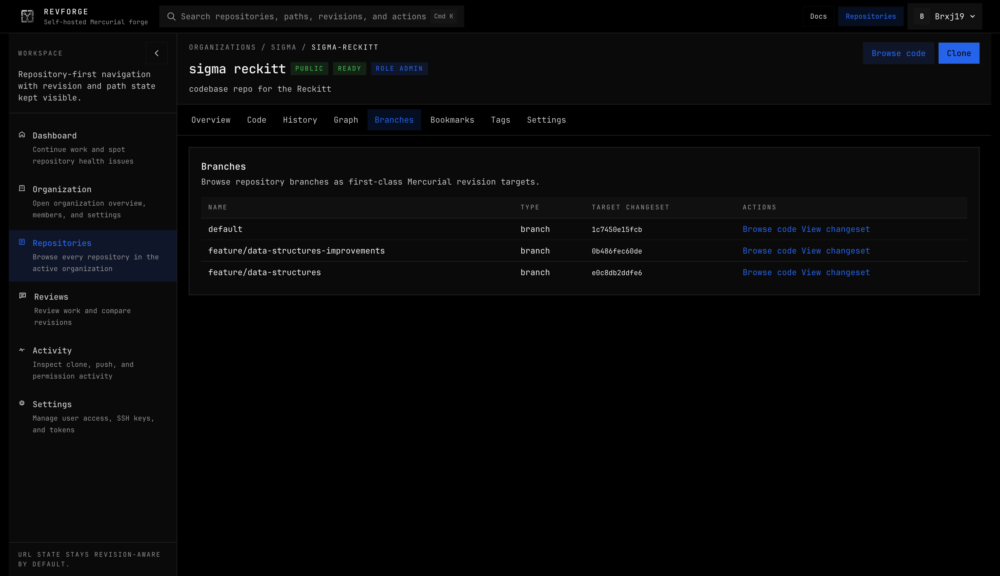

### Activity

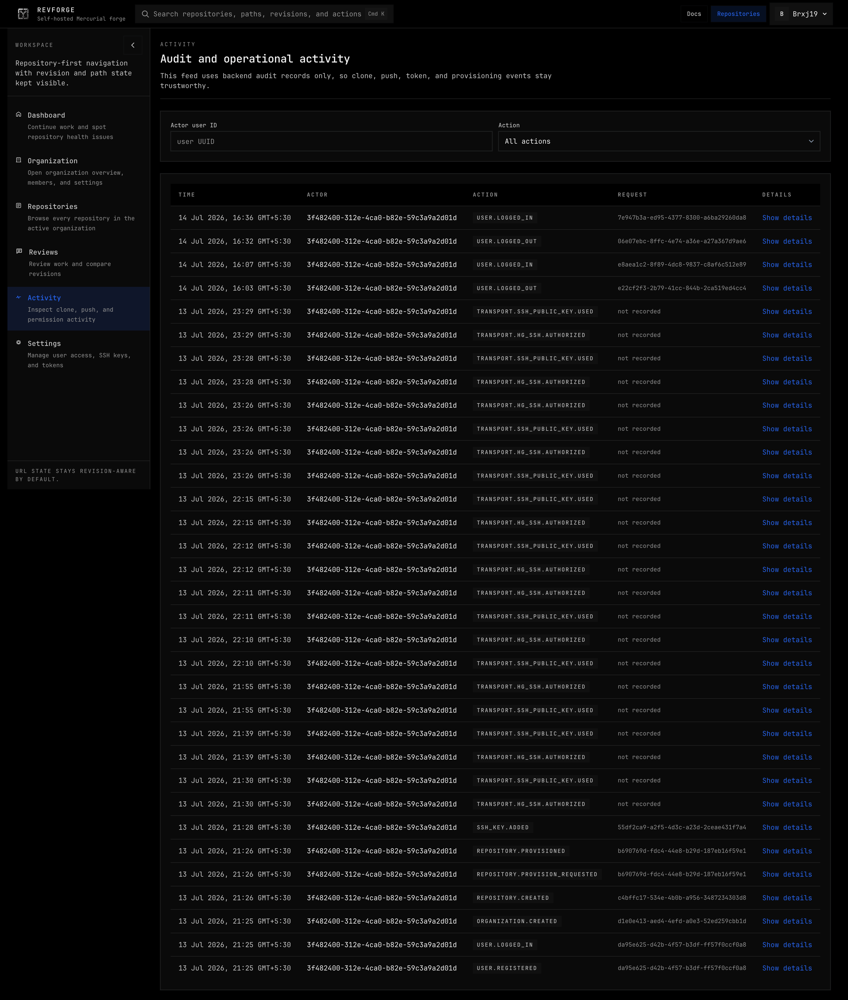

### Settings And Access

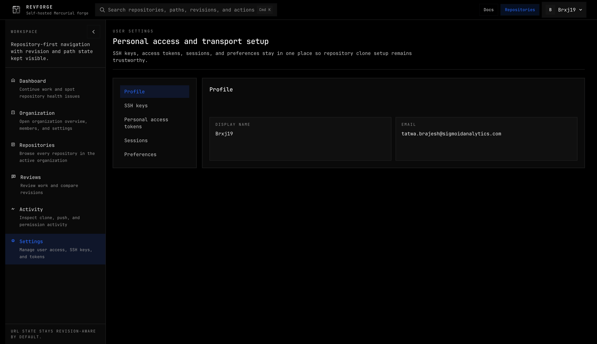

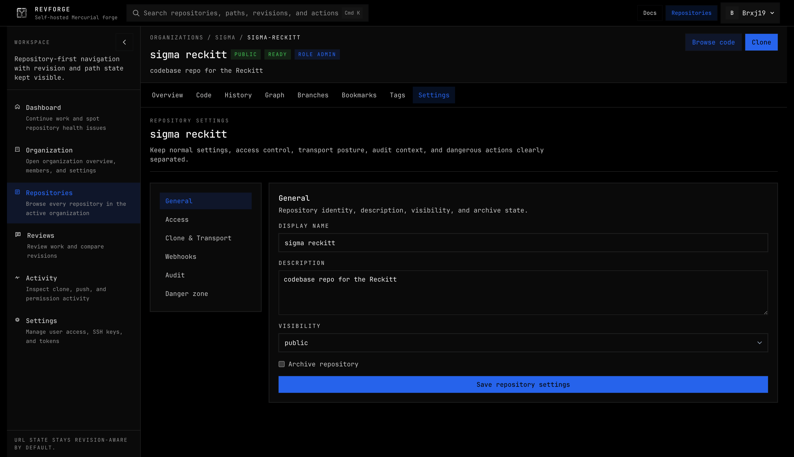

## Documentation

For local setup, platform-specific commands, Docker workflows, and troubleshooting, see [LOCAL_STACK_SETUP.md](LOCAL_STACK_SETUP.md).

## Design Direction

RevForge is being shaped as a dark, repository-first Mercurial forge with dense history views, deliberate operational clarity, and an interface centered around real revision workflows.
