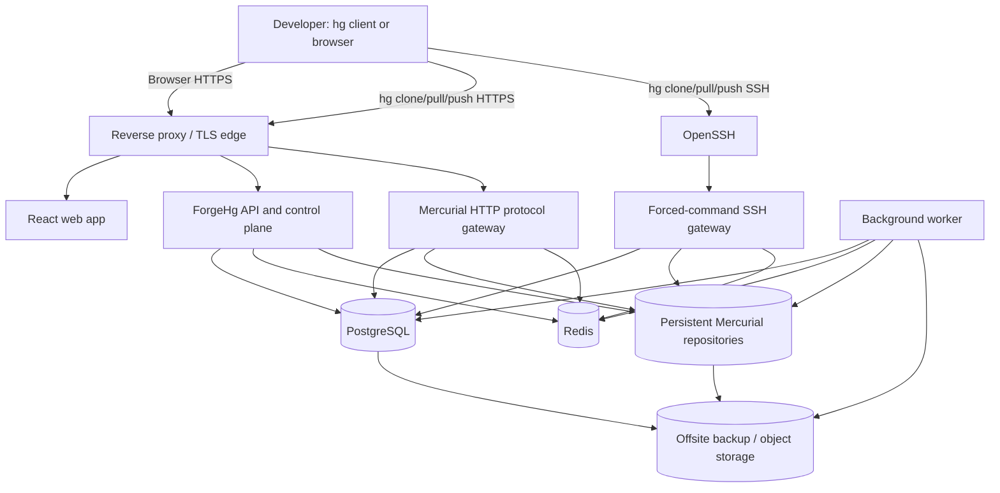
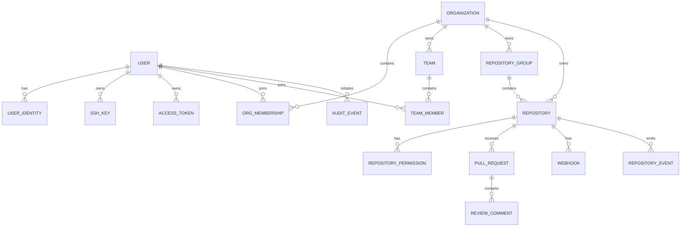

# Detailed Plan: Build a Mature Mercurial Hosting Platform

> **Working name:** ForgeHg (replace this with your final product name)  
> **Primary goal:** Build an independent, self-hosted platform for hosting, browsing, cloning, pulling, pushing, reviewing, governing, and operating **Mercurial repositories**.  
> **Non-goal:** Do not run Kallithea as the product. Kallithea is used only as a behavioural and architectural reference.

---

## Table of Contents

1. [Product Definition](#1-product-definition)
2. [Guiding Decisions](#2-guiding-decisions)
3. [Scope and Release Boundaries](#3-scope-and-release-boundaries)
4. [Target Architecture](#4-target-architecture)
5. [Technology Choices](#5-technology-choices)
6. [Mercurial Protocol Strategy](#6-mercurial-protocol-strategy)
7. [Security Model](#7-security-model)
8. [Data Model](#8-data-model)
9. [Repository Storage Design](#9-repository-storage-design)
10. [Backend Modules and API Plan](#10-backend-modules-and-api-plan)
11. [Frontend Plan](#11-frontend-plan)
12. [Core User Flows](#12-core-user-flows)
13. [Eventing, Hooks, and Background Jobs](#13-eventing-hooks-and-background-jobs)
14. [Development Repository Layout](#14-development-repository-layout)
15. [Local macOS Development Setup](#15-local-macos-development-setup)
16. [Phased Implementation Roadmap](#16-phased-implementation-roadmap)
17. [Testing Strategy](#17-testing-strategy)
18. [CI/CD and Release Process](#18-cicd-and-release-process)
19. [Production Deployment and Operations](#19-production-deployment-and-operations)
20. [Observability, Backups, and Disaster Recovery](#20-observability-backups-and-disaster-recovery)
21. [Key Risks and Mitigations](#21-key-risks-and-mitigations)
22. [Kallithea Reference Study Map](#22-kallithea-reference-study-map)
23. [Definition of Done](#23-definition-of-done)
24. [Immediate Next Actions](#24-immediate-next-actions)

---

# 1. Product Definition

## 1.1 Problem statement

Mercurial is a mature distributed version-control system, but teams need more than a folder of repositories reachable over SSH. They need a central place to:

- discover repositories;
- control access by organization, team, and repository;
- clone, pull, and push safely using standard Mercurial clients;
- inspect changesets, files, branches, bookmarks, tags, and diffs in a browser;
- review proposed changes before integrating them;
- record audit events and repository activity;
- automate notifications and CI through webhooks;
- recover repositories and service metadata reliably after failures.

ForgeHg will be the **control plane and collaboration layer** around native Mercurial repositories. Mercurial itself remains responsible for repository storage, history, transactions, bundles, and network protocol behaviour.

## 1.2 Product principles

1. **Native Mercurial first**  
   Existing users must keep using normal commands such as `hg clone`, `hg pull`, and `hg push`. Do not invent a custom client protocol.

2. **Do not reimplement Mercurial internals**  
   Do not recreate revlogs, changelog parsing, bundle generation, wire-protocol framing, or repository locking. Delegate these to the supported Mercurial executable and Python modules.

3. **Security before convenience**  
   Every web request, HTTPS protocol operation, SSH command, background job, webhook, and repository path must have explicit authorization and safe input handling.

4. **Modular monolith first**  
   Keep the first deployable version simple enough to run as a small number of services, while keeping module boundaries clean enough to split later.

5. **Operations are a product feature**  
   Backups, restore drills, audit logs, observability, upgrades, and incident runbooks are part of the release plan, not later extras.

6. **Clear licensing boundary**  
   Kallithea is GPL-licensed. Study its public behaviour and architecture, but do not copy source code into a differently licensed ForgeHg codebase. Independently implement every feature and keep a short design record for each feature inspired by an external project.

## 1.3 Primary personas

| Persona | Main needs |
|---|---|
| Platform administrator | Configure the server, organizations, SSO, repository policies, storage, backups, and audit access. |
| Organization owner | Create teams and repositories, assign permissions, manage membership, configure webhooks and policies. |
| Maintainer | Push changes, protect important branches/bookmarks, review changes, approve merge requests, manage repository settings. |
| Developer | Clone, pull, push authorized changes, browse code, create review requests, comment, and use SSH keys or access tokens. |
| Auditor / security reviewer | Inspect activity, access changes, push history, token usage, and administrative events. |
| CI service account | Authenticate with narrowly scoped token/key, read source, report status, and receive webhooks. |

---

# 2. Guiding Decisions

## 2.1 Architecture decisions to lock early

| Decision | Chosen direction | Why |
|---|---|---|
| Product shape | Self-hosted Mercurial forge | Matches the goal: a real hosting platform rather than a local GUI. |
| Initial backend style | Python modular monolith | Mercurial’s server libraries are Python-native; Python lowers integration risk. |
| Web API | FastAPI | Good typing, OpenAPI generation, async-friendly API surface, and familiar ecosystem. |
| Protocol HTTP gateway | Dedicated WSGI-compatible Mercurial gateway service | `hgweb` is WSGI-oriented; isolating it avoids forcing protocol code through custom FastAPI handlers. |
| SSH access | OpenSSH + forced-command gateway | Standard client compatibility and a narrow attack surface. |
| Database | PostgreSQL | Safe concurrent writes, migrations, indexing, JSON support, reliable backups. |
| Cache/queue | Redis plus a worker process | Background indexing, email, webhook delivery, cache invalidation, rate-limit counters. |
| Frontend | React + TypeScript + Tailwind | Product-grade UI and a component model suitable for repository browsing and review screens. |
| Repository storage | Local persistent filesystem at first | Mercurial repositories need predictable local filesystem semantics and locks. |
| Deployment | Docker Compose first | Reproducible local and small-team deployments without Kubernetes complexity. |
| Production OS | Linux server | Better fit for OpenSSH, system permissions, persistent volumes, service management, monitoring, and backups. |

## 2.2 Deliberate non-decisions

Do **not** decide these too early:

- Kubernetes;
- multi-region active-active replication;
- full-text code search across every revision;
- package registry support;
- Git support;
- a mobile app;
- complex policy engines;
- custom SSH daemon implementation.

The first platform must be excellent at Mercurial hosting, not broad at every forge feature.

---

# 3. Scope and Release Boundaries

## 3.1 MVP: a usable private Mercurial host

The first usable release must support:

- local users and organizations;
- private repositories;
- repository creation, archival, and logical deletion;
- repository access levels: `read`, `write`, `admin`;
- HTTPS clone, pull, and push using Personal Access Tokens (PATs);
- SSH clone, pull, and push using uploaded SSH keys;
- repository browser;
- commit history, changeset page, file tree, raw file view, and diff view;
- branches, bookmarks, tags, and basic compare view;
- activity/audit events for user, repository, key, token, and push/pull operations;
- hooks that enqueue post-push work;
- backups and a documented restore procedure;
- Docker Compose deployment.

## 3.2 Team-ready release

Add after the MVP works end-to-end:

- teams and nested repository groups;
- webhooks with signed deliveries and retry queue;
- email notifications;
- repository policies such as protected branches/bookmarks;
- pull/merge requests with comments and approvals;
- organization-level default permissions;
- optional OIDC/SSO;
- admin audit exports;
- repository archival and retention policy;
- metrics, tracing, and health dashboards.

## 3.3 Later release candidates

These are valuable but not core to initial correctness:

- SAML and LDAP;
- code search;
- CI status checks;
- repository mirroring;
- large-file workflows;
- backup replication to another region;
- public repository mode;
- Git support;
- self-service runner fleet;
- advanced compliance/legal hold controls.

---

# 4. Target Architecture

## 4.1 Logical architecture



## 4.2 Deployment units

Start with these services:

1. **web**  
   React application, statically built and served by the reverse proxy.

2. **api**  
   FastAPI service for browser/API use: users, organizations, repositories, permissions, review requests, audit queries, settings, and administration.

3. **hg-http-gateway**  
   WSGI service that authenticates a Mercurial HTTP request, determines minimum required permission, validates the repository, injects a controlled Mercurial configuration, and hands the request to native `hgweb`.

4. **ssh-gateway**  
   A small command-line Python executable called by OpenSSH through a forced `authorized_keys` command. It accepts only valid Mercurial protocol commands and then starts the native Mercurial SSH protocol server.

5. **worker**  
   Handles post-push indexing, repository statistics, webhook delivery, email, asynchronous audit enrichment, and backup verification.

6. **postgres**  
   Stores all ForgeHg metadata. It does not store Mercurial history itself.

7. **redis**  
   Queue broker, cache, short-lived state, rate limiting, and invalidation signals.

8. **reverse proxy**  
   Caddy or Nginx: TLS, reverse proxying, request size/time limits, security headers, and static asset delivery.

## 4.3 Boundary rule

The web/API layer must **never** write inside `.hg` directly. Only native Mercurial commands and native Mercurial library entrypoints may mutate repository state.

---

# 5. Technology Choices

## 5.1 Recommended stack

```text
Frontend             React + TypeScript + Vite + Tailwind CSS
API                  Python 3.12+ + FastAPI + SQLAlchemy + Alembic
Protocol gateway     Python + Mercurial + WSGI server
SSH gateway          Python CLI + OpenSSH forced commands + Mercurial sshserver
Database             PostgreSQL
Queue/cache          Redis + Dramatiq or Celery
Authentication       Local accounts initially; OIDC later
Reverse proxy        Caddy initially, Nginx acceptable
Storage              Local POSIX filesystem; restic to S3-compatible offsite backup
Testing              pytest, Playwright, Testcontainers, real `hg` protocol fixtures
Observability        OpenTelemetry + Prometheus metrics + Grafana + structured JSON logs
Packaging            Docker Compose; OCI images
```

## 5.2 Why this is better than a pure FastAPI-only design

A pure FastAPI design is excellent for the control plane, but Mercurial’s server-side HTTP machinery is designed around its own WSGI-facing `hgweb` implementation. The protocol gateway should be thin and purpose-built:

```text
Authenticate → authorize → select repository → configure safe hooks → delegate to hgweb
```

This retains compatibility with standard Mercurial clients and avoids implementing the wire protocol yourself.

## 5.3 Mercurial version policy

- Pin one exact Mercurial version in development and production images.
- Upgrade Mercurial through a dedicated compatibility test suite, not casually.
- Treat Mercurial’s Python internals as version-sensitive implementation details.
- Keep protocol-gateway integration tests for clone, pull, push, large request, read-only access, and denied access before every upgrade.

---

# 6. Mercurial Protocol Strategy

## 6.1 Critical rule

Do not write your own implementation of Mercurial’s HTTP or SSH wire protocol.

Instead:

- use `mercurial.hgweb.hgweb(...)` for HTTP protocol serving;
- use `mercurial.wireprotoserver.sshserver(...).serve_forever()` for SSH stdio protocol serving;
- use controlled `hg` subprocess calls for read-only browser/indexing operations where that is safer and easier to maintain.

## 6.2 HTTPS protocol flow

### Clone/pull request flow

```text
hg client
  → HTTPS request with PAT/basic auth
  → reverse proxy
  → hg-http-gateway
  → authenticate token
  → resolve canonical repository path
  → determine required capability (read unless command can mutate)
  → authorize repository access
  → create isolated Mercurial UI/config
  → invoke hgweb WSGI app
  → return native Mercurial protocol response
```

### Push request flow

```text
hg client
  → HTTPS request with PAT/basic auth
  → hg-http-gateway
  → classify request as write or unknown
  → require write permission for unknown/mutating operations
  → initialize repository hook context
  → invoke hgweb
  → Mercurial performs native transaction/locking
  → pre-push policy hooks may reject
  → post-push hook writes event to durable spool/outbox
  → worker updates metadata and dispatches webhooks
```

## 6.3 HTTP command classification

Mercurial HTTP protocol requests may represent read-only or write-capable commands. Authorization must be conservative.

Rules:

1. Maintain a version-pinned allow-list of **known read-only commands**.
2. Treat `unbundle`, `pushkey`, and any mutating command as `write`.
3. For batch requests, inspect every subcommand.
4. If a command is unknown, malformed, missing, or cannot be parsed, require `write` permission or reject it.
5. Write automated tests against the pinned Mercurial client version whenever the command map changes.
6. Never trust only the HTTP method; protocol operations may use unexpected methods and headers.

This conservative model ensures new or malformed protocol commands do not accidentally bypass write authorization.

## 6.4 SSH protocol flow

### Desired user experience

```bash
hg clone ssh://hg@forge.example.com/acme/payments
```

### Internal security flow

```text
Developer SSH key
  → OpenSSH matches one generated authorized_keys entry
  → forced command runs `forgehg-ssh-serve <key-id>`
  → gateway receives SSH_ORIGINAL_COMMAND
  → strict parser accepts only supported Mercurial protocol invocation
  → validate repository identifier against database record
  → identify user from key-id
  → check read/write permission
  → disable pushes for read-only access
  → start native Mercurial SSH stdio server
```

### Required OpenSSH restrictions

Every generated key entry must disable interactive and forwarding features:

```text
no-pty,no-port-forwarding,no-X11-forwarding,no-agent-forwarding,command="..."
```

Optional hardening after testing:

```text
no-user-rc,no-streamlocal-forwarding
```

### SSH command allow-list

The gateway must accept only the command form emitted by a normal Mercurial client for the configured version, such as:

```text
hg -R <repository> serve --stdio
```

It must reject:

```text
sh
bash
scp
sftp
rsync
hg --config ...
hg -R ../../etc serve --stdio
any command with extra unapproved flags
```

Implementation rules:

- Parse `SSH_ORIGINAL_COMMAND` with a shell-aware parser, not string splitting.
- Do not invoke a shell.
- Use argument arrays only.
- Resolve repository names through database metadata, never by concatenating user input into a filesystem path.
- Re-check access inside the gateway even though OpenSSH authenticated the key.

## 6.5 Read-only SSH access

Do not rely solely on a UI rule to block pushes. For a read-only user, configure native Mercurial pre-transaction hooks that reject write attempts before the transaction completes.

That makes the authorization boundary survive protocol-level behaviour and client variations.

## 6.6 Repository browser operations

For browser/API features, create a `MercurialRepositoryAdapter` with fixed read-only methods:

```text
get_repository_summary()
list_changesets()
get_changeset(node)
get_file_tree(revision, path)
get_file_content(revision, path)
get_raw_file(revision, path)
get_diff(base, target, path_filter)
list_branches()
list_bookmarks()
list_tags()
compare_revisions(left, right)
get_repository_size()
```

Implementation constraints:

- Accept only validated revisions and paths.
- Invoke `hg` with a fixed command template and no shell.
- Enforce process timeout, memory/output size limits, and concurrency limits.
- Cache safely by repository ID + revision/node + request parameters.
- Do not run `hg update` in a hosting repository directory.

---

# 7. Security Model

## 7.1 Threat model

Primary threats include:

- unauthorized repository reads or pushes;
- command injection through repository paths, branch names, SSH commands, hook config, or subprocess calls;
- path traversal to another repository or host file;
- leaked personal access tokens and SSH keys;
- malicious webhooks or SSRF through webhook targets;
- denial of service through large pushes, expensive diffs, protocol requests, or malformed objects;
- privilege escalation through confused organization/repository permission inheritance;
- tampering with audit evidence;
- lost data caused by failed backups or accidental deletion.

## 7.2 Authorization vocabulary

Use exactly three repository-level roles at first:

| Role | Capabilities |
|---|---|
| `read` | Browse web UI, clone, pull, view metadata, download allowed archives. |
| `write` | All read capabilities plus push, create review requests, update supported repository metadata. |
| `admin` | All write capabilities plus repository settings, webhooks, permissions, archival, and transfer operations. |

Do not use ambiguous role names such as `developer` or `contributor` at the permission-engine level. Map friendly team roles to the three canonical capabilities.

## 7.3 Permission resolution order

Use a deterministic precedence rule:

```text
Explicit user repository rule
  > explicit team repository rule
  > repository group rule
  > organization default rule
  > platform default rule
  > deny
```

Rules:

- Explicit deny is not needed in v1 if it complicates reasoning; use absence of grant.
- Admins are not automatically granted access to every organization unless the system policy explicitly says so.
- All access checks must return both the final capability and the source rule used for audit/debugging.

## 7.4 Authentication methods

### Browser/API

- Local username/password with Argon2id password hashing for initial setup.
- Session cookies: `HttpOnly`, `Secure`, `SameSite=Lax` or stricter.
- CSRF protection for state-changing browser requests.
- OIDC login added after local auth works.

### HTTPS Mercurial clients

- Personal Access Tokens used as Basic Auth credentials over TLS.
- Tokens are shown only once.
- Store only a salted/hashed verifier, never the raw token.
- Give tokens expiry, revocation, last-used timestamp, label, owner, organization/repository scope, and capability scope.
- Prefer one purpose-limited token per CI integration.

### SSH Mercurial clients

- User uploads a public key.
- Parse and validate supported key formats strictly.
- Store normalized public key fingerprint and metadata.
- Generate managed `authorized_keys` entries from the database.
- Record last seen timestamp and source IP after successful authentication.

## 7.5 Input validation rules

### Repository slug

A canonical repository slug can initially be:

```text
lowercase letters, numbers, hyphen, underscore, slash between path segments
```

Examples:

```text
acme/payments
acme/platform/api-gateway
team_1/experiment-02
```

Reject:

```text
../secret
/acme/repo
acme//repo
acme/.hg
acme/repo.git
spaces or shell metacharacters
```

### File path

- Normalise path as a logical Mercurial repository path.
- Reject paths that escape the repository root.
- Do not pass raw user path to a shell or a host filesystem command.

### Revision identifier

- Accept full node IDs, validated short node IDs, or constrained symbolic names when explicitly supported.
- Resolve symbols through Mercurial, then operate using immutable full node ID where possible.

## 7.6 Hook safety

- Platform hooks are shipped by ForgeHg, versioned, and loaded from a read-only application path.
- Repository owners cannot configure arbitrary host shell commands in v1.
- Custom hooks, if ever allowed, run in a restricted separate worker/container with no access to privileged host credentials.
- Pre-push policy hooks have strict timeout and output limits.
- Post-push hooks must not make core repository availability depend on an external network call.

## 7.7 Webhook safety

- Block loopback, private address ranges, link-local addresses, and cloud metadata endpoints by default.
- Resolve DNS at delivery time and re-check destination IP after resolution.
- Use signed payloads with per-webhook secret.
- Enforce outbound connect/read timeout, max response size, retry backoff, and dead-letter state.
- Show delivery logs without exposing secrets.

## 7.8 Operational security

- Run containers as non-root user.
- Repository storage owned by one dedicated service account.
- API service cannot obtain root privileges or access host Docker socket.
- SSH server listens only to the required interface.
- Firewall opens only HTTPS and SSH.
- Use TLS for all public traffic.
- Rotate database passwords, token signing keys, and webhook secrets through documented procedure.
- Keep dependency scanning and container image scanning in CI.

---

# 8. Data Model

## 8.1 Core entities



## 8.2 Required tables

### `users`

```text
id
username (unique, immutable after initial period or controlled rename)
email (unique where present)
password_hash
is_platform_admin
status: active | suspended | deleted
created_at
updated_at
last_login_at
```

### `organizations`

```text
id
slug (unique)
display_name
description
owner_user_id
visibility_policy
created_at
updated_at
```

### `organization_memberships`

```text
organization_id
user_id
organization_role: owner | member | billing_admin(optional)
created_at
```

### `teams` and `team_memberships`

```text
teams: id, organization_id, slug, display_name, description
team_memberships: team_id, user_id, role
```

### `repository_groups`

```text
id
organization_id
parent_group_id nullable
slug
display_name
path_cache (canonical full group path)
created_at
```

### `repositories`

```text
id
organization_id
repository_group_id nullable
slug
canonical_path (unique, e.g. acme/platform/payments)
display_name
description
visibility: private | internal | public
status: active | archived | deleting | deleted
storage_key
owner_user_id
default_branch_or_bookmark nullable
created_at
updated_at
archived_at nullable
```

### `repository_permissions`

```text
id
repository_id
principal_type: user | team
principal_id
capability: read | write | admin
source: explicit | inherited_snapshot(optional)
created_at
created_by
```

### `ssh_keys`

```text
id
user_id
key_type
public_key_normalized
fingerprint_sha256 (unique)
label
status: active | revoked
last_seen_at
created_at
revoked_at nullable
```

### `access_tokens`

```text
id
user_id
name
token_prefix
token_hash
scope_type: global | organization | repository
scope_target_id nullable
capability: read | write | admin
expires_at nullable
last_used_at nullable
revoked_at nullable
created_at
```

### `pull_requests`

```text
id
repository_id
number (unique within repository)
title
description
state: open | merged | closed | declined
source_ref
source_head_node
target_ref
target_head_node_at_creation
author_user_id
merge_strategy nullable
created_at
updated_at
closed_at nullable
```

### `review_comments`, `review_approvals`, `webhooks`, `webhook_deliveries`

Store immutable event context where practical so later branch movement does not rewrite review history.

### `repository_events`

```text
id
repository_id
event_type: push | pull | repository_created | archived | permission_changed | ...
actor_user_id nullable
authentication_method: web | token | ssh_key | system
ssh_key_id nullable
request_id nullable
source_ip nullable
payload_json
occurred_at
```

### `audit_events`

Platform-level immutable events:

```text
id
actor_user_id nullable
action
resource_type
resource_id
organization_id nullable
request_id
source_ip
before_json nullable
after_json nullable
created_at
```

## 8.3 Database rules

- Use UUID or ULID external identifiers if you do not want sequential IDs exposed in URLs.
- Add database constraints, not only application-level validation.
- Add unique indexes for canonical repository path, username, organization slug, SSH key fingerprint, and token prefix.
- Use transactions for every state transition.
- Do not delete audit events during normal product operations.

---

# 9. Repository Storage Design

## 9.1 Storage structure

```text
/srv/forgehg/
├── repos/
│   ├── acme/
│   │   ├── payments/
│   │   │   └── .hg/
│   │   └── platform/
│   │       └── api-gateway/
│   │           └── .hg/
│   └── demo/
│       └── hello-world/
│           └── .hg/
├── event-spool/
├── tmp/
├── exports/
└── backups-local/
```

Mercurial repositories are regular repository directories containing `.hg`. They are not Git bare repositories. The platform must not create or depend on a checked-out working copy for normal hosting operations.

## 9.2 Storage key vs user-visible path

Do not make the database depend entirely on the visible slug.

Use:

```text
Repository ID:           01J... (stable identity)
Canonical display path:  acme/platform/payments
Storage key:             repos/01J... or repos/acme/platform/payments
```

Recommended initial choice:

```text
storage key = canonical path
```

Add a future migration mechanism before allowing repository rename/move. The database must retain stable repository ID even if its visible path changes.

## 9.3 Repository creation transaction

1. Validate organization and repository path.
2. Authorize creator as organization owner or permitted maintainer.
3. Create `repositories` record in `creating` state.
4. Create parent directories with safe ownership and permissions.
5. Run `hg init <absolute-storage-path>` as the repository service user.
6. Install or ensure platform-controlled configuration/hooks.
7. Mark repository `active` in PostgreSQL.
8. Record audit event.
9. If any filesystem step fails, mark the record failed and clean up through a compensating job.

## 9.4 Rename and move strategy

Do not implement repository rename in the first release until the following are in place:

- exclusive maintenance lock;
- filesystem move transaction;
- database update transaction;
- redirect/alias policy for old clone URLs;
- webhook URL revalidation;
- audit record;
- backup snapshot before move;
- tested recovery plan.

## 9.5 Archive and delete strategy

Use staged deletion:

```text
active → archived → scheduled_for_deletion → deleted
```

- **Archive:** blocks pushes, keeps read access according to policy, retains all history.
- **Scheduled deletion:** invisible to normal users but recoverable within retention period.
- **Deleted:** metadata retained in a tombstone/audit form; repository directory moved to quarantine then purged by a job.

Never run irreversible recursive deletion directly from a browser request.

---

# 10. Backend Modules and API Plan

## 10.1 Module boundaries

```text
apps/api/
  auth/
  users/
  organizations/
  teams/
  repositories/
  permissions/
  mercurial_adapter/
  reviews/
  webhooks/
  audit/
  notifications/
  admin/
  health/

apps/hg_http_gateway/
apps/ssh_gateway/
apps/worker/
packages/common/
```

Each module owns:

- request/response schemas;
- business rules;
- database access layer;
- audit-event emission;
- tests;
- migration impact.

## 10.2 Essential API endpoints

### Authentication and identity

```http
POST /api/v1/auth/login
POST /api/v1/auth/logout
POST /api/v1/auth/password/reset
GET  /api/v1/me
GET  /api/v1/me/ssh-keys
POST /api/v1/me/ssh-keys
DELETE /api/v1/me/ssh-keys/{keyId}
GET  /api/v1/me/tokens
POST /api/v1/me/tokens
DELETE /api/v1/me/tokens/{tokenId}
```

### Organizations and teams

```http
GET  /api/v1/organizations
POST /api/v1/organizations
GET  /api/v1/organizations/{orgSlug}
PATCH /api/v1/organizations/{orgSlug}
GET  /api/v1/organizations/{orgSlug}/members
POST /api/v1/organizations/{orgSlug}/members
GET  /api/v1/organizations/{orgSlug}/teams
POST /api/v1/organizations/{orgSlug}/teams
```

### Repositories

```http
GET    /api/v1/repos/{repoPath}
POST   /api/v1/organizations/{orgSlug}/repos
PATCH  /api/v1/repos/{repoPath}
POST   /api/v1/repos/{repoPath}/archive
POST   /api/v1/repos/{repoPath}/restore
DELETE /api/v1/repos/{repoPath}
GET    /api/v1/repos/{repoPath}/permissions
PUT    /api/v1/repos/{repoPath}/permissions/{principal}
DELETE /api/v1/repos/{repoPath}/permissions/{principal}
```

### Browser

```http
GET /api/v1/repos/{repoPath}/summary
GET /api/v1/repos/{repoPath}/changesets
GET /api/v1/repos/{repoPath}/changesets/{node}
GET /api/v1/repos/{repoPath}/tree/{revision}/{path...}
GET /api/v1/repos/{repoPath}/raw/{revision}/{path...}
GET /api/v1/repos/{repoPath}/diff?base={rev}&target={rev}&path={optional}
GET /api/v1/repos/{repoPath}/refs/branches
GET /api/v1/repos/{repoPath}/refs/bookmarks
GET /api/v1/repos/{repoPath}/refs/tags
GET /api/v1/repos/{repoPath}/compare?source={rev}&target={rev}
```

### Review and collaboration

```http
GET  /api/v1/repos/{repoPath}/pull-requests
POST /api/v1/repos/{repoPath}/pull-requests
GET  /api/v1/repos/{repoPath}/pull-requests/{number}
PATCH /api/v1/repos/{repoPath}/pull-requests/{number}
POST /api/v1/repos/{repoPath}/pull-requests/{number}/comments
POST /api/v1/repos/{repoPath}/pull-requests/{number}/approvals
POST /api/v1/repos/{repoPath}/pull-requests/{number}/merge
```

### Webhooks and audit

```http
GET  /api/v1/repos/{repoPath}/webhooks
POST /api/v1/repos/{repoPath}/webhooks
PATCH /api/v1/repos/{repoPath}/webhooks/{webhookId}
GET  /api/v1/repos/{repoPath}/webhooks/{webhookId}/deliveries
GET  /api/v1/audit-events
```

## 10.3 API design rules

- Every mutation requires authenticated principal plus permission check.
- Use idempotency keys for destructive or asynchronous create operations where appropriate.
- Return stable error codes such as `REPO_NOT_FOUND`, `REPO_ACCESS_DENIED`, `INVALID_REPOSITORY_PATH`, and `TOKEN_EXPIRED`.
- Avoid leaking a private repository’s existence to unauthorized users.
- Include request IDs in errors and logs.
- Document APIs through generated OpenAPI plus hand-written examples.

---

# 11. Frontend Plan

## 11.1 Core routes

```text
/sign-in
/sign-up
/explore
/{org}
/{org}/settings
/{org}/members
/{org}/teams
/{org}/{repo}
/{org}/{repo}/changesets
/{org}/{repo}/changeset/{node}
/{org}/{repo}/files/{revision}/{path...}
/{org}/{repo}/diff/{base}...{target}
/{org}/{repo}/branches
/{org}/{repo}/bookmarks
/{org}/{repo}/tags
/{org}/{repo}/compare
/{org}/{repo}/pull-requests
/{org}/{repo}/pull-requests/{number}
/{org}/{repo}/settings
/settings/profile
/settings/ssh-keys
/settings/access-tokens
/admin
```

## 11.2 Screen priorities

### First usable screens

1. Sign in / first admin bootstrap.
2. Organization dashboard.
3. Repository list.
4. Create repository modal/page.
5. Repository overview with clone URLs.
6. Changeset list.
7. Changeset diff page.
8. File browser and raw-file page.
9. SSH key and token management.
10. Repository members/permissions page.

### Later screens

- Pull request list and details.
- Inline review comments.
- Webhook management and delivery history.
- Audit explorer.
- Admin operations dashboard.

## 11.3 UX requirements

- Show both HTTPS and SSH clone commands with copy buttons.
- Display the exact access error without exposing private repository metadata.
- Use immutable changeset node IDs in URLs where practical.
- Make branch/bookmark context visible everywhere.
- Large diffs must be truncated safely with a download/raw option.
- Avoid rendering untrusted file content as executable HTML.
- Render Markdown with sanitization.
- Provide clear empty states for repositories with no commits.

---

# 12. Core User Flows

## 12.1 Bootstrap platform admin

1. Deployment sets `FORGEHG_BOOTSTRAP_ADMIN_EMAIL` and one-time setup secret.
2. First visit opens controlled setup flow only when no platform admin exists.
3. Create admin user with strong password.
4. Setup secret becomes invalid after use.
5. Audit the bootstrap event.

## 12.2 Create an organization and repository

1. User selects **Create organization**.
2. API validates organization slug and creates owner membership.
3. User selects **New repository**.
4. API validates repository slug/path and permission.
5. Worker or API performs `hg init` as service account.
6. Platform records repository, storage path, default permissions, and audit event.
7. UI shows clone commands:

```bash
hg clone https://forge.example.com/acme/payments
hg clone ssh://hg@forge.example.com/acme/payments
```

## 12.3 HTTPS clone/pull using token

1. Developer creates a read or write PAT.
2. Client performs a Mercurial HTTPS operation.
3. Gateway validates TLS request and Basic Auth token.
4. Gateway resolves token scope and repository permission.
5. Gateway classifies protocol operation conservatively.
6. Gateway delegates to `hgweb` only after authorization.
7. A pull event is recorded asynchronously or sampled according to retention policy.

## 12.4 SSH clone/push using key

1. Developer uploads public SSH key.
2. ForgeHg validates key structure and stores fingerprint.
3. Key sync writes a forced-command entry to managed `authorized_keys`.
4. `hg` invokes SSH with repository protocol command.
5. SSH gateway maps forced command key ID to user.
6. Gateway validates original protocol command and repository name.
7. Gateway checks read/write role.
8. Mercurial handles native protocol transaction.
9. Push hook emits durable `push.completed` event.
10. Worker updates activity, cache, statistics, notifications, and webhooks.

## 12.5 Create a pull/merge request

Mercurial’s collaboration model differs from Git hosting. Design the first review flow around immutable revisions and explicit target/source references.

1. Developer pushes changes to a bookmark/branch or a fork.
2. Developer opens a pull request with `source_ref`, `source_head_node`, `target_ref`, and captured `target_head_node`.
3. Platform calculates changeset range/diff using Mercurial adapter.
4. Reviewers comment on general discussion or stable file/line anchors tied to node IDs.
5. Approvals are recorded against the review version.
6. Before merge, platform re-checks target head and policy.
7. Merge is performed only through an explicit, auditable server-side workflow or a clearly documented external workflow in the first iteration.

**Important:** Do not claim that a “merge” is universally safe until the exact Mercurial branch/bookmark and conflict-resolution workflow is designed and tested. Initial release may support review without server-side merge automation.

---

# 13. Eventing, Hooks, and Background Jobs

## 13.1 Why hooks are necessary

A browser/API process does not automatically know that a repository changed because a user pushed through Mercurial HTTP or SSH. Native Mercurial hooks provide the reliable bridge from protocol transaction to platform events.

## 13.2 Event categories

```text
repository.created
repository.archived
repository.deleted
repository.push.accepted
repository.pull.completed
repository.refs.changed
repository.index.requested
repository.index.completed
review.created
review.comment.created
review.approved
webhook.delivery.requested
webhook.delivery.completed
backup.completed
backup.failed
```

## 13.3 Durable post-push event pattern

Do not call external webhook URLs directly inside a Mercurial transaction hook.

Recommended pattern:

```text
Mercurial post-push hook
  → collect immutable context: repository ID, user ID, key/token ID, source IP, pushed nodes, timestamp
  → atomically write JSON event file to event spool
  → return quickly

Worker
  → claims event file
  → inserts/updates durable database event using idempotency key
  → invalidates cache
  → indexes latest history
  → sends webhooks
  → marks event handled or moves it to retry/dead-letter state
```

## 13.4 Pre-push policy hooks

Use only for checks that must block a push:

- repository is archived;
- actor has no write capability;
- protected branch/bookmark rule;
- repository size limit;
- basic commit metadata policy;
- optional signed commit policy later.

Requirements:

- bounded timeout;
- no network dependency;
- clear error message returned to user;
- tests for deny and allow paths;
- no arbitrary user-supplied shell command execution.

## 13.5 Worker queues

Suggested queues:

```text
critical: auth/key synchronization, repository lifecycle
normal: post-push indexing, activity updates
webhooks: outbound webhook deliveries
notifications: email and in-app notifications
maintenance: backup verification, statistics, cleanup
```

---

# 14. Development Repository Layout

Use a monorepo at first. It simplifies coordinated protocol, API, schema, and UI changes.

```text
forgehg/
├── README.md
├── docs/
│   ├── architecture/
│   │   ├── ADR-001-modular-monolith.md
│   │   ├── ADR-002-native-mercurial-protocol.md
│   │   ├── ADR-003-ssh-forced-command.md
│   │   └── threat-model.md
│   ├── runbooks/
│   │   ├── backup-restore.md
│   │   ├── key-rotation.md
│   │   ├── repository-recovery.md
│   │   └── incident-response.md
│   └── api/
├── apps/
│   ├── api/
│   │   ├── app/
│   │   ├── alembic/
│   │   └── tests/
│   ├── hg_http_gateway/
│   │   ├── app/
│   │   └── tests/
│   ├── ssh_gateway/
│   │   ├── forgehg_ssh/
│   │   └── tests/
│   ├── worker/
│   │   ├── app/
│   │   └── tests/
│   └── web/
│       ├── src/
│       └── e2e/
├── packages/
│   ├── common/
│   ├── authz/
│   ├── mercurial_adapter/
│   └── event_contracts/
├── infra/
│   ├── compose/
│   ├── caddy/
│   ├── ssh/
│   ├── systemd/
│   ├── docker/
│   └── scripts/
├── test-fixtures/
│   ├── hg-repos/
│   └── ssh-keys/
├── Makefile
├── compose.yaml
├── .env.example
└── pyproject.toml
```

## 14.1 Documentation to create alongside code

Create these from the first week of implementation:

```text
README.md
ARCHITECTURE.md
THREAT_MODEL.md
API_CONVENTIONS.md
LOCAL_DEVELOPMENT.md
PROTOCOL_COMPATIBILITY.md
BACKUP_AND_RESTORE.md
OPERATIONS_RUNBOOK.md
SECURITY.md
CONTRIBUTING.md
```

---

# 15. Local macOS Development Setup

Your Mac is the development environment. Do not make the local MacBook the assumed production host.

## 15.1 Dependencies

Install through Homebrew:

```bash
brew install python@3.12 mercurial postgresql@16 redis docker docker-compose git
```

Use Docker Desktop or another compatible container runtime for local service dependencies.

## 15.2 Local service model

```text
Mac host
  ├── source code checkout
  ├── Mercurial client for manual protocol tests
  └── Docker Compose
      ├── PostgreSQL
      ├── Redis
      ├── API
      ├── hg-http-gateway
      ├── worker
      ├── Caddy/Nginx
      └── optional local mail catcher
```

For SSH testing, choose one of these approaches:

1. Run a local OpenSSH container with a mapped non-privileged port such as `2222`.
2. Run a dedicated test VM/container to avoid modifying your macOS system SSH configuration.
3. Use host OpenSSH only after the container approach is fully understood and documented.

## 15.3 Local configuration files

```text
.env.example
.env.local                 # never committed
infra/compose/compose.dev.yaml
infra/ssh/sshd_config.dev
infra/caddy/Caddyfile.dev
```

## 15.4 Local developer commands

Create a `Makefile` with predictable commands:

```bash
make bootstrap
make up
make down
make logs
make db-migrate
make db-reset
make test
make test-protocol
make test-e2e
make lint
make format
make create-demo-data
make backup
make restore-check
```

## 15.5 First manual protocol checklist

Use real Mercurial commands, not mocks only:

```bash
hg init demo-client
cd demo-client
printf '# Demo\n' > README.md
hg add README.md
hg commit -m 'Initial commit'
hg push https://<token>@localhost/acme/demo
hg clone https://<token>@localhost/acme/demo clone-http
hg clone ssh://hg@localhost:2222/acme/demo clone-ssh
```

Verify:

- pull with read token works;
- push with read token fails;
- clone with revoked token fails;
- SSH key with read permission cannot push;
- malformed SSH command fails;
- accessing `../` paths fails;
- post-push activity appears in UI;
- database event and repository history agree.

---

# 16. Phased Implementation Roadmap

Each phase ends with acceptance criteria. Do not begin the next major phase until the current criteria pass in CI and manually against a real `hg` client.

## Phase 0 — Product and architecture foundation

### Deliverables

- Project name, repository, license decision, contribution policy.
- Architecture diagram and ADRs.
- Threat model.
- UI information architecture/wireframes.
- Data-model ERD.
- Local Docker Compose skeleton.
- CI pipeline skeleton.

### Tasks

- Decide whether the project is private, source-available, or open-source.
- Select coding standards, formatter, linter, test conventions, and commit policy.
- Create the first ADRs:
  - native protocol delegation;
  - modular monolith;
  - repository path canonicalization;
  - token and SSH authentication;
  - event-spool/outbox approach.
- Create a fixture Mercurial repository with branches/bookmarks/tags/diffs.

### Acceptance criteria

- `docker compose up` starts Postgres, Redis, API placeholder, gateway placeholder, worker placeholder, and web placeholder.
- CI runs formatting, linting, unit tests, and container build.
- One engineer can bootstrap the project from `README.md` without undocumented steps.

## Phase 1 — Identity, organizations, and permission engine

### Deliverables

- Local user registration/bootstrap admin.
- Login/logout/session handling.
- Organizations, members, teams.
- Canonical permission resolver.
- Audit-event framework.

### Tasks

- Implement `users`, `organizations`, memberships, teams, and membership tables.
- Build auth middleware and repository authorization service.
- Add tests for precedence rules and private repository non-disclosure.
- Implement management UI for personal profile and organizations.
- Add structured request IDs.

### Acceptance criteria

- User can create organization and invite/add member.
- Permission resolver returns correct role and source grant for all matrix tests.
- Unauthorized user cannot distinguish missing from private repository through API responses.
- All identity and permission mutations create audit events.

## Phase 2 — Repository lifecycle and persistent storage

### Deliverables

- Create/list/view/archive/restore repository.
- Safe filesystem storage adapter.
- Repository metadata page.
- Initial backup command for repository directory and database.

### Tasks

- Create repository path validator and canonicalizer.
- Implement safe storage-root path resolver.
- Run `hg init` using fixed argument list and dedicated service account/container user.
- Track states: creating, active, archived, deletion_scheduled, deleted.
- Add clone URL composition service.
- Implement storage integration tests.

### Acceptance criteria

- Repository creation produces a valid `hg` repository that a local client can inspect.
- Invalid names and path traversal attempts fail.
- Archive prevents write through API state and is ready for protocol enforcement in later phase.
- Backup command can create artifacts for an empty and populated repository.

## Phase 3 — Read-only repository browser

### Deliverables

- Changeset history.
- Changeset detail/diff view.
- File tree and raw file view.
- Branch, bookmark, tag pages.
- Compare endpoint.

### Tasks

- Implement `MercurialRepositoryAdapter`.
- Use fixed Mercurial commands/templates or carefully pinned APIs.
- Add response cache keyed by repository/node/path.
- Add process timeout, output limits, and safe error translation.
- Build browser screens and syntax highlighting with safe rendering.

### Acceptance criteria

- Browser displays repository state accurately for test fixture with multiple changesets.
- Diff and file paths work for Unicode and nested paths.
- Large output is truncated safely rather than exhausting memory.
- Adapter cannot execute arbitrary shell commands through API parameters.

## Phase 4 — HTTPS native Mercurial protocol gateway

### Deliverables

- HTTPS clone/pull using PAT.
- HTTPS push using write PAT.
- Protocol request authorization.
- Request/event logging and rate limits.

### Tasks

- Implement PAT issuance, secure storage, revocation, expiration, and scopes.
- Implement authentication gateway before `hgweb` handoff.
- Build read/write protocol command classifier pinned to supported Mercurial version.
- Configure native Mercurial UI safely: no arbitrary host config, platform hooks only.
- Add protocol integration tests using real `hg` client.

### Acceptance criteria

- `hg clone`, `hg pull`, and `hg push` work over HTTPS.
- Read token cannot push.
- Write token can only access repositories in its scope.
- Unknown protocol command never receives read-only authorization by default.
- Auth failures and protocol failures do not leak secrets or private repository data.

## Phase 5 — SSH key management and native SSH protocol gateway

### Deliverables

- SSH public-key management UI/API.
- Managed `authorized_keys` generation.
- Forced-command Mercurial SSH gateway.
- Read-only and write SSH access enforcement.

### Tasks

- Validate key syntax and fingerprints.
- Generate restricted key lines atomically.
- Implement `SSH_ORIGINAL_COMMAND` strict parser.
- Resolve key → user → repository permission.
- Start native Mercurial SSH stdio server only after validation.
- Apply transaction-reject hook for read-only SSH sessions.
- Build Docker/OpenSSH protocol test environment.

### Acceptance criteria

- `hg clone ssh://...` works with valid read key.
- Push works only with write key.
- Interactive SSH, port forwarding, and arbitrary commands are rejected.
- Revoking a key prevents future protocol access after key sync.
- Gateway logs key ID, user ID, repository, IP, and outcome without logging private key material.

## Phase 6 — Hooks, event processing, activity, and webhooks

### Deliverables

- Durable post-push events.
- Repository activity feed.
- Cache invalidation after push.
- Signed webhooks with delivery history and retries.

### Tasks

- Implement event spool with atomic write/claim semantics.
- Implement worker idempotency and dead-letter handling.
- Add push events based on immutable changeset node IDs.
- Build repository activity UI.
- Implement outbound network SSRF protections.
- Add test webhook receiver to integration suite.

### Acceptance criteria

- A push is visible in UI without manual refresh/index command.
- Duplicate hook event does not create duplicate audit/activity entries.
- Failed webhook retries follow backoff policy and retain diagnostics.
- A webhook outage cannot make `hg push` unavailable.

## Phase 7 — Pull requests and review workflow

### Deliverables

- Create/edit/close pull request.
- Changeset range comparison.
- General comments, inline comments, approvals.
- Review state and notification basics.

### Tasks

- Define exact source/target semantics for branches/bookmarks/forks.
- Capture immutable source and target heads on PR creation.
- Implement diff anchors using file path + base node + target node + line context.
- Support outdated-comment display when revisions change.
- Add reviewer assignment and approval rules.
- Start with manual merge workflow if server-side merge is not fully safe.

### Acceptance criteria

- Review can be opened against a known target reference.
- Diff remains reproducible from captured nodes.
- Comments survive later pushes as historical discussion.
- Review permissions align with repository roles.

## Phase 8 — Hardening, observability, and production readiness

### Deliverables

- Metrics, logs, traces, dashboards.
- Backup automation and restore drill.
- Admin dashboards.
- Runbooks and security review.
- Production deployment manifest.

### Tasks

- Add readiness/liveness checks.
- Add Prometheus metrics for protocol requests, latency, error counts, worker backlog, storage, and auth denials.
- Automate database dump + repository backup + offsite encrypted replication.
- Run full restore into isolated environment.
- Add dependency/image scanning, rate limits, secret scanning, and security headers.
- Create upgrade runbook for ForgeHg and Mercurial versions.

### Acceptance criteria

- Fresh production-like environment can restore a representative backup and serve clone/pull from restored repositories.
- Dashboards show queue backlog, disk usage, HTTP errors, SSH failures, and backup status.
- Service has documented response procedure for key compromise, failed backup, accidental deletion, and failed upgrade.

---

# 17. Testing Strategy

## 17.1 Test layers

| Layer | Purpose | Examples |
|---|---|---|
| Unit tests | Pure rules and helpers | permission precedence, path validation, token hashing, SSH command parser. |
| Integration tests | Database/Redis/filesystem behaviour | repo creation transaction, event spool, Alembic migrations, access checks. |
| Protocol tests | Real Mercurial compatibility | HTTPS clone/pull/push, SSH clone/pull/push, read-only rejection. |
| UI tests | Browser flows | create repo, upload SSH key, view diff, create token. |
| Security tests | Prevent common bypasses | traversal, injection, SSRF, revoked token, malformed batch request. |
| Performance tests | Bound resource use | large repo history, large diff, simultaneous clones, push event backlog. |
| Restore tests | Recoverability | restore PostgreSQL + repository backup into clean environment. |

## 17.2 Protocol contract test matrix

Create this as executable test suite, not manual documentation only.

| Scenario | HTTPS | SSH | Expected |
|---|---:|---:|---|
| Anonymous private clone | Yes | Yes | Denied without repository disclosure. |
| Read credentials clone | Yes | Yes | Allowed. |
| Read credentials pull | Yes | Yes | Allowed. |
| Read credentials push | Yes | Yes | Denied before mutation. |
| Write credentials push | Yes | Yes | Allowed. |
| Expired token | Yes | N/A | Denied. |
| Revoked token/key | Yes | Yes | Denied. |
| Wrong organization repo | Yes | Yes | Denied. |
| Path traversal | Yes | Yes | Denied. |
| Malformed protocol command | Yes | Yes | Denied safely. |
| Archived repository pull | Yes | Yes | Policy-defined, usually allowed read. |
| Archived repository push | Yes | Yes | Denied. |
| Hook worker outage | Yes | Yes | Push succeeds; event remains durable for retry. |

## 17.3 Security test cases

- User with team read and explicit user write resolves correctly.
- User removed from team loses access immediately or within documented cache invalidation bound.
- PAT cannot be retrieved after creation.
- Token is not visible in logs, browser telemetry, audit payloads, or error messages.
- SSH `SSH_ORIGINAL_COMMAND` with quoting tricks, duplicate flags, unexpected executable path, shell metacharacters, invalid UTF-8, and extra arguments is rejected.
- Repository slug cannot resolve outside storage root.
- Webhook to `127.0.0.1`, `localhost`, metadata IPs, private RFC1918 IPs, or DNS rebinding target is rejected.
- Browser file rendering does not execute repository HTML/JavaScript.

---

# 18. CI/CD and Release Process

## 18.1 Pull request checks

Every code change should run:

```text
format check
lint/type check
unit tests
integration tests
migration validation
protocol tests for changed gateway/adapter code
frontend build
container build
secret scan
dependency vulnerability scan
license scan
```

## 18.2 Release stages

```text
feature branch
  → pull request
  → preview/test environment
  → main branch
  → staging environment
  → production release
  → post-release smoke tests
```

## 18.3 Migration rules

- Every schema change uses Alembic migration.
- Migrations must be forward-compatible when possible.
- Destructive migrations require backup verification and explicit release note.
- Application version and schema version must be checked at startup.
- Rollback strategy must be written before migration merges.

## 18.4 Supply-chain policy

- Pin Python dependencies with hashes/lockfile.
- Pin container base images by digest for production releases.
- Generate an SBOM for releases.
- Scan dependencies and images in CI.
- Sign release artifacts when the project reaches team use.

---

# 19. Production Deployment and Operations

## 19.1 Recommended small-team topology

```text
One Linux server or VPS initially
  ├── reverse proxy
  ├── ForgeHg API
  ├── Mercurial HTTP gateway
  ├── worker
  ├── PostgreSQL
  ├── Redis
  ├── OpenSSH
  └── persistent local repository volume

Separate offsite backup target
  └── encrypted restic repository in S3-compatible storage
```

## 19.2 Minimum production requirements

```text
2 vCPU minimum
4 GB RAM minimum for small team use
SSD-backed persistent storage
separate backup destination
static IP/domain name
TLS certificate automation
firewall
non-root deployment account
monitoring and alerting
```

Actual capacity depends primarily on repository count, history size, concurrent clones/pushes, diff complexity, and webhook volume. Measure before scaling.

## 19.3 Container persistence

Persist these paths outside container layers:

```text
PostgreSQL data
Mercurial repositories
SSH authorized_keys generated file or mounted directory
Event spool
Backup staging area
Application secret/config mounts
```

## 19.4 Reverse proxy responsibilities

- TLS certificate issuance/renewal.
- Force HTTPS.
- Forward needed headers safely.
- Set protocol-aware request size and timeout limits.
- Rate-limit login, token endpoints, and protocol authentication failures.
- Serve static frontend files.
- Do not cache authenticated protocol responses.

## 19.5 SSH service responsibilities

- Key-only authentication for ForgeHg protocol user.
- No interactive shell for ForgeHg protocol user.
- Managed forced command per uploaded key.
- Strong logging and rate limiting/fail2ban/CrowdSec policy where suitable.
- Separate administrator SSH account and service protocol account.

---

# 20. Observability, Backups, and Disaster Recovery

## 20.1 Structured logs

Emit JSON logs with fields such as:

```text
timestamp
level
service
request_id
user_id
organization_id
repository_id
repository_path
auth_method
token_id_or_key_id (non-secret identifier only)
source_ip
action
outcome
latency_ms
error_code
```

Never log:

- access tokens;
- passwords;
- private keys;
- raw authorization headers;
- full webhook secrets;
- sensitive repository contents.

## 20.2 Metrics

Track at minimum:

```text
HTTP request count, latency, 4xx/5xx
Mercurial protocol request count by operation category
protocol authorization denials
SSH gateway accepts/denials
active clone/push sessions
worker queue depth and job failures
post-push indexing lag
webhook success/failure/retry count
PostgreSQL connection pool state
Redis health
repository storage disk usage
backup success/failure/age
restore verification timestamp
```

## 20.3 Backup plan

Back up **both** system-of-record categories:

1. PostgreSQL metadata.
2. Mercurial repository storage.

Recommended baseline:

```text
Frequent PostgreSQL logical or physical backup
Frequent repository filesystem snapshot/archive
Encrypted offsite copy
Retention policy with daily/weekly/monthly recovery points
Automated backup integrity check
Regular full restore test
```

## 20.4 Restore procedure outline

1. Provision clean isolated environment.
2. Restore PostgreSQL backup.
3. Restore repository filesystem snapshot to correct storage root.
4. Verify service account ownership and permissions.
5. Start ForgeHg in maintenance mode.
6. Run repository inventory/reconciliation task.
7. Validate sample `hg verify`, clone, pull, browser history, access control, and audit state.
8. Open service only after validation passes.
9. Record restore drill result and corrective actions.

## 20.5 Recovery targets

Define and document before production launch:

```text
RPO: maximum accepted data loss window
RTO: maximum accepted recovery duration
```

Do not invent promises until you have tested backup cadence, storage throughput, and restoration in an environment representative of production.

---

# 21. Key Risks and Mitigations

| Risk | Impact | Mitigation |
|---|---|---|
| Reimplementing wire protocol | Incompatible or unsafe host | Delegate to native `hgweb` and Mercurial SSH server. |
| Authorization bypass through new protocol command | Unauthorized write/read | Conservative unknown = write/deny policy; pin Mercurial version; protocol contract tests. |
| SSH command injection | Host compromise | Forced command, strict parser, no shell, only exact allowed command form. |
| Path traversal | Access to host/repositories | Canonical slug validator, DB lookup, storage-root resolver, no raw joins. |
| Kallithea GPL code contamination | License conflict | Independent implementation, no code copy, source-reference notes, code review check. |
| Hook blocks push due to external outage | Developer disruption | Fast durable local event spool; async workers; no network call in post-push hook. |
| Lost repo data | Severe business failure | Offsite encrypted backups and verified restores. |
| Worker duplicates events | Duplicate webhooks/audit | Idempotency key based on repository/event/node/session context. |
| Large repo/DOS | Service instability | concurrency limits, per-operation timeout, output caps, disk quotas, rate limiting. |
| Complex server-side merge semantics | Incorrect history/conflicts | Review-only first; server merge only after explicit design and tests. |
| Overbuilding too early | Slow/no launch | Phase gates and strict MVP boundary. |

---

# 22. Kallithea Reference Study Map

The supplied Kallithea source archive is useful for understanding mature implementation patterns. Treat the following as **behavioural references only**, not source to copy.

| Kallithea source area | What to study | ForgeHg independent equivalent |
|---|---|---|
| `kallithea/config/middleware/simplehg.py` | HTTP Mercurial protocol detection, cautious read/write command mapping, handing request to `hgweb`. | `apps/hg_http_gateway/` command classifier and WSGI delegate. |
| `kallithea/bin/kallithea_cli_ssh.py` | Forced-command entrypoint and `SSH_ORIGINAL_COMMAND` handling. | `apps/ssh_gateway/forgehg_ssh/cli.py`. |
| `kallithea/lib/vcs/ssh/hg.py` | Strict accepted Mercurial SSH invocation and native `wireprotoserver` handoff. | `apps/ssh_gateway/forgehg_ssh/mercurial.py`. |
| `kallithea/lib/vcs/ssh/base.py` | Key/user lookup, permission check, read-only vs write session flow. | `packages/authz/ssh_authorizer.py`. |
| `kallithea/lib/ssh.py` | SSH public-key structural validation and restricted authorized-key options. | `packages/common/ssh_keys.py`. |
| `kallithea/lib/hooks.py` | Push/pull event logging and cache invalidation concepts. | `apps/worker/event_processor.py` plus spool contract. |
| `kallithea/lib/utils.py` | Controlled Mercurial UI configuration and platform hooks. | `packages/mercurial_adapter/safe_ui.py`. |

## 22.1 Clean-room checklist

Before implementing a feature inspired by Kallithea:

1. Write the desired behaviour in an ADR or issue in your own words.
2. Read Mercurial official documentation and protocol behaviour first.
3. Create an original API/design.
4. Implement from scratch.
5. Test using externally observable behaviour rather than copied test code.
6. Record any third-party license obligations for dependencies.

---

# 23. Definition of Done

ForgeHg is ready for serious small-team use only when all of the following are true:

## Product

- Users can create organizations, teams, and private Mercurial repositories.
- Users can browse history, files, diffs, branches, bookmarks, and tags.
- Users can clone/pull/push over HTTPS and SSH using standard Mercurial clients.
- Read/write/admin permissions are correct and visible.
- SSH keys and tokens can be created, rotated, and revoked.
- Repository activity and audit events are present.
- Pull request/review workflow is either complete or deliberately excluded with clear documented workflow.

## Security

- No arbitrary command execution path exists through repository names, SSH command, hooks, or browser parameters.
- Private repository existence is not leaked to unauthorized users.
- Token/key revocation works and is tested.
- TLS and secure cookie settings are active.
- Webhook SSRF controls are active.
- Dependency/image/license scans pass.

## Reliability

- Core protocol suite passes against real Mercurial client.
- Pushes survive worker/webhook outages through durable event capture.
- Backups include PostgreSQL and repositories.
- Restore drill has succeeded in clean environment.
- Disk-space and backup-failure alerts exist.
- Upgrade/runbook documentation exists.

## Operations

- Service has health checks, dashboards, logs, and alerts.
- Admin onboarding, user onboarding, incident response, and backup restore instructions exist.
- Production deployment is repeatable from version-controlled infrastructure.

---

# 24. Immediate Next Actions

Implement these in order:

1. Create the `forgehg` monorepo and baseline directory layout.
2. Write the first four ADRs: native protocol delegation, modular monolith, repository path rules, and SSH forced-command security.
3. Set up Docker Compose with Postgres, Redis, API, gateway, worker, web, and a test OpenSSH container.
4. Build a fixture Mercurial repository and real-client protocol test harness before building UI features.
5. Implement identity, organization, repository model, and permission resolver.
6. Implement repository creation through `hg init` and build the read-only browser.
7. Add HTTPS protocol gateway with PAT authentication.
8. Add SSH gateway with strict forced-command parsing.
9. Add durable post-push events and background worker.
10. Add review workflow, observability, backups, restore drill, and production hardening.

---

## Appendix A — Suggested First Milestone Issue List

```text
[Foundation] Initialize monorepo and toolchain
[Foundation] Add Docker Compose and dev Makefile
[Docs] Add architecture overview and ADR template
[Docs] Define repository slug/path specification
[Docs] Write threat model v1
[Backend] Create Alembic baseline and core user/org schema
[Backend] Implement session authentication
[Backend] Implement organization membership and team membership
[Backend] Implement repository permission resolver with tests
[Backend] Implement repository create/list/archive service
[Backend] Build Mercurial fixture repository generator
[Backend] Implement read-only Mercurial adapter
[Frontend] Create sign-in and organization dashboard
[Frontend] Create repository overview and history pages
[Protocol] Create HTTP gateway prototype serving one test repo
[Protocol] Add PAT authentication and authorization tests
[Protocol] Create SSH forced-command prototype in test container
[Protocol] Add SSH key parsing, management, and revocation
[Events] Implement event spool and worker idempotency
[Ops] Add backup script and restore-check script
[CI] Add real Mercurial clone/push protocol test job
```

## Appendix B — Suggested ADR Titles

```text
ADR-001: Use Native Mercurial HTTP and SSH Protocol Servers
ADR-002: Start as a Modular Monolith with Separate Protocol Gateways
ADR-003: Use PostgreSQL for Control-Plane Metadata
ADR-004: Store Mercurial Repositories on a Local Persistent Filesystem
ADR-005: Canonical Repository Paths and Storage Boundary Rules
ADR-006: Use Personal Access Tokens for HTTPS Mercurial Authentication
ADR-007: Use OpenSSH Forced Commands for SSH Repository Access
ADR-008: Unknown Mercurial Protocol Commands Require Write Authorization
ADR-009: Use a Durable Local Spool for Post-Push Event Capture
ADR-010: No Arbitrary User-Defined Host Hooks in Initial Releases
ADR-011: Treat Kallithea as Behavioural Reference Only; Do Not Copy GPL Code
ADR-012: Server-Side Merge Automation Is Deferred Until Mercurial Workflow Is Proven
```
